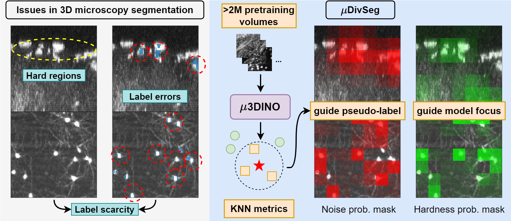

# Harnessing SSL for Segmentation in 3D Microscopy with Noisy Labels and Hard Patches

***ECCV (2026)***

Tony Xu, Ahmadreza Attarpour, Shruti Patel, Fengqing Yu, Matthew W Rozak, Bojana Stefanovic, Anne Martel, Maged Goubran

[Paper (todo)]() | [HF Weights (todo)]()

This codebase will provide the weights for our pretrained model for 3D microscopy: **μ3DINO**, and our self-correcting
segmentation pipeline for microscopy under noisy labels and hard regions: **μDivSeg**. Our paper "Harnessing SSL for
Segmentation in 3D Microscopy with Noisy Labels and Hard Patches" was accepted to ECCV 2026 in Malmö, Sweden.

**Abstract:** Segmentation in 3D microscopy is challenging due to hard (to segment) patches, noisy labels resulting from
the use of semi-automated labeling methods, image artifacts, off-target fluorescence, and lack of labeled data because
of high labeling effort. In this work, we introduce a novel unified method to tackle these issues simultaneously in 3D
microscopy. First, we introduce μ3DINO, a 3D model pretrained on an ultra-large multimodal dataset of over 2 million
microscopy volumes. We then create μDivSeg, a segmentation pipeline that uses pretrained weights to detect noisy labels
and hard patches to guide and correct segmentation training. We evaluate our methods on a toy dataset and 4 real-world
datasets from light-sheet and two-photon microscopy with a variety of markers, in comparison to two state-of-the-art (SOTA) pipelines. 
Our methods outperform SOTA techniques on increasing levels of synthetic label perturbations and
real-world data with diverse distributions.

